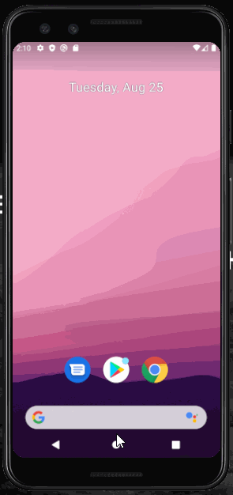

# Project 1 - SimpleToDo

Simple ToDo app is an android app that allows building a todo list and basic todo items management functionality including adding new items, editing and deleting an existing item.

Submitted by: Tasha Ogoti

Time spent: 40 hours spent in total

## User Stories

The following **required** functionality is completed:

* [x] User can **view a list of todo items**
* [x] User can **successfully add items** from the todo list
* [x] User's **list of items persisted** upon modification and and retrieved properly on app restart

The following **optional** feature is implemented:

* [x] User can **tap a todo item in the list and bring up an edit screen for the todo item** 

## Video Walkthrough

Here's a walkthrough of implemented user stories:

 title='Video Walkthrough' width='' alt='Video Walkthrough' />

GIF created with [LiceCap](http://www.cockos.com/licecap/).

## Notes

Manipulating the buttons was at first difficult due to the a harcoded string error.
Attempting to delete an item results in either closing of the application or an error message.  

## License

    Copyright [yyyy] [name of copyright owner]

    Licensed under the Apache License, Version 2.0 (the "License");
    you may not use this file except in compliance with the License.
    You may obtain a copy of the License at

        http://www.apache.org/licenses/LICENSE-2.0

    Unless required by applicable law or agreed to in writing, software
    distributed under the License is distributed on an "AS IS" BASIS,
    WITHOUT WARRANTIES OR CONDITIONS OF ANY KIND, either express or implied.
    See the License for the specific language governing permissions and
    limitations under the License.

